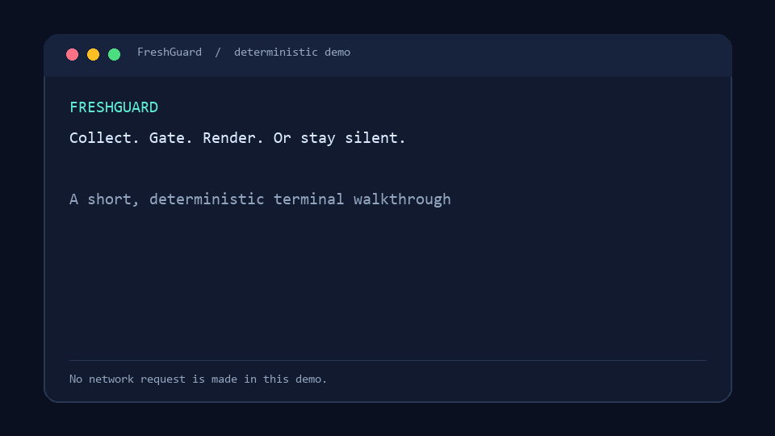

# FreshGuard v2.1.0

> **Collect. Gate. Render. Or stay silent.**

FreshGuard is a no-dependency guardrail for scheduled LLM briefings. It collects curated RSS/Atom sources, admits only fresh and source-bound evidence, then renders an extractive Markdown digest. If the freshness threshold is not met, it produces a quiet, explicit no-content result rather than an invented “daily update.”

It is built for small, auditable monitoring workflows—not a general-purpose web search engine or a source-of-truth verifier.

[](LICENSE)

## See it in 17 seconds



The GIF uses a fixed, non-live fixture: it shows the whole contract—collect, gate, render, and `NO_NEW_CONTENT` stays silent—without embedding a real feed, local path, or account detail. Inspect the exact sample in [examples/demo-evidence.json](examples/demo-evidence.json), or reproduce its Markdown output:

```bash
python scripts/render_briefing.py --input examples/demo-evidence.json \
  --output examples/demo-digest.md --title "AI research watch"
```

`examples/demo-digest.md` is ignored because it is reproducible output. Maintainers can regenerate the committed GIF with `python scripts/render_demo_gif.py`; that optional asset helper uses Pillow and is not part of the core runtime.

## What v2 adds

- Portable JSON feed profiles with declared source type and provenance tier.
- RSS/Atom summary extraction, HTML cleanup, bounded context, HTTPS-by-default feeds, and a 2 MiB input limit.
- An extractive Markdown renderer that preserves source labels and warns on title-only items.
- A manual GitHub Actions workflow that uploads an evidence JSON + Markdown digest artifact.
- Offline regression tests for the core gate, profile adapter, and renderer.

## Run the included AI research watch

```bash
git clone https://github.com/York0912/freshguard.git
cd freshguard

# Collect, normalize, deduplicate, and gate evidence.
python scripts/rss_guard.py --profile profiles/ai-research.json \
  --state-file .freshguard/seen.sqlite > evidence.json

# Render the evidence without adding new claims.
python scripts/render_briefing.py --input evidence.json \
  --output digest.md --title "AI research watch"
```

`evidence.json` is either a JSON evidence object, `NO_NEW_CONTENT`, or a `SEARCH_ERROR` written to stderr with a non-zero exit. Pass only JSON evidence to an LLM and use [prompts/daily-briefing.md](prompts/daily-briefing.md); it requires claims to remain bound to the item’s `_sl` source label.

> **Data boundary:** `evidence.json`, `digest.md`, `output/`, and `.freshguard/` are ignored by Git. They may contain third-party source content. Never commit them to a public repository, and never add private, customer, paid, or personal feeds to this public repository or its Actions workflow.

The provided profile watches arXiv’s `cs.AI` and `cs.CL` feeds plus `openai-python` releases. Copy the profile and replace its feeds for policy, industry, research, or product monitoring.

## Create a profile

```json
{
  "name": "My policy watch",
  "freshness": { "hours": 72, "min_items": 2, "max_items": 12 },
  "feeds": [
    {
      "url": "https://example.gov/updates.atom",
      "source_name": "Example regulator",
      "source_type": "government",
      "source_tier": "official"
    }
  ]
}
```

`source_tier` is a declared provenance cue: `primary`, `official`, `curated`, or `unrated`. It does not establish truth, completeness, or relevance. Feed URLs must use HTTPS by default; `--allow-http` is an explicit local-only exception. FreshGuard intentionally does not scrape full articles; the renderer is extractive and flags title-only entries.

For one-off feeds, omit the profile:

```bash
python scripts/rss_guard.py --feed https://export.arxiv.org/rss/cs.AI \
  --hours 168 --min 1 --max-items 10 --summary-chars 600
```

## GitHub Actions: manual, reviewable delivery

In GitHub, open **Actions → Generate AI research digest → Run workflow**. The workflow does not schedule itself. It restores the prior deduplication state, collects the included public profile, renders a digest, and uploads `evidence.json`, `digest.md`, and the refreshed deduplication database as an artifact for review. Artifacts expire after one day and remain unsuitable for private-source monitoring.

Turn on a schedule only after manually reviewing several runs and choosing an external delivery channel. The repository deliberately does not send emails, post messages, or call an LLM by default.

## Contracts

| Signal | Exit | Meaning |
|---|:---:|---|
| JSON evidence | 0 | Fresh evidence meets the minimum; render or analyze it. |
| `NO_NEW_CONTENT` | 0 | Do not generate a briefing; render a quiet no-content artifact if needed. |
| `SEARCH_ERROR` | 1 | Feed infrastructure failed; alert/retry instead of treating it as silence. |

FreshGuard separates four concerns:

```
RSS/Atom sources → normalize + provenance → freshness/dedup gate → evidence JSON → extractive Markdown or LLM
```

The core gate is provider-neutral and remains available in [reference/python/search_template.py](reference/python/search_template.py). The ready-to-run adapter is [scripts/rss_guard.py](scripts/rss_guard.py).

## Boundaries

- **FreshGuard does:** preserve URLs, publication dates, source labels, declared provenance tiers, and no-content/error distinctions.
- **FreshGuard does not:** verify source truth, fetch paywalled/full-text content, rank importance, or confirm that an LLM interpreted a source correctly.
- **FreshGuard treats feeds as untrusted input:** it rejects XML entity declarations, bounds response size, escapes Markdown output, and instructs downstream LLMs not to follow feed-supplied instructions.
- For high-stakes decisions, review source pages and add domain-specific fact checking after the gate.

## Verify locally

```bash
python tests/test-freshguard.py
python tests/test-rss-guard.py
python tests/test-render-briefing.py
python tests/test-demo-gif.py
bash tests/test-bash-wrapper.sh
```

## Repository map

| Path | Purpose |
|---|---|
| [SKILL.md](SKILL.md) | Agent-facing workflow and hard rules |
| [profiles/](profiles/) | Portable monitoring configurations |
| [scripts/rss_guard.py](scripts/rss_guard.py) | RSS/Atom collector + FreshGuard gate |
| [scripts/render_briefing.py](scripts/render_briefing.py) | Extractive Markdown renderer |
| [scripts/render_demo_gif.py](scripts/render_demo_gif.py) | Maintainer helper for the deterministic demo GIF |
| [examples/](examples/) | Non-live, source-contract demonstration fixture |
| [prompts/daily-briefing.md](prompts/daily-briefing.md) | Source-bound LLM prompt contract |
| [.github/workflows/](.github/workflows/) | CI and manually triggered digest workflow |
| [schemas/](schemas/) | Evidence and output JSON contracts |
| [tests/](tests/) | Offline regression tests |

## License

MIT — use it, but keep the evidence boundary intact.
